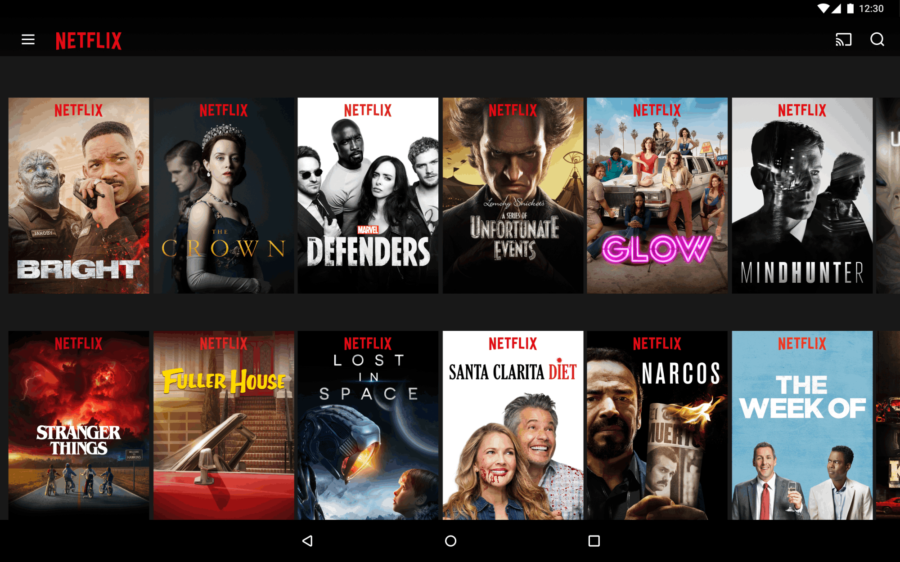
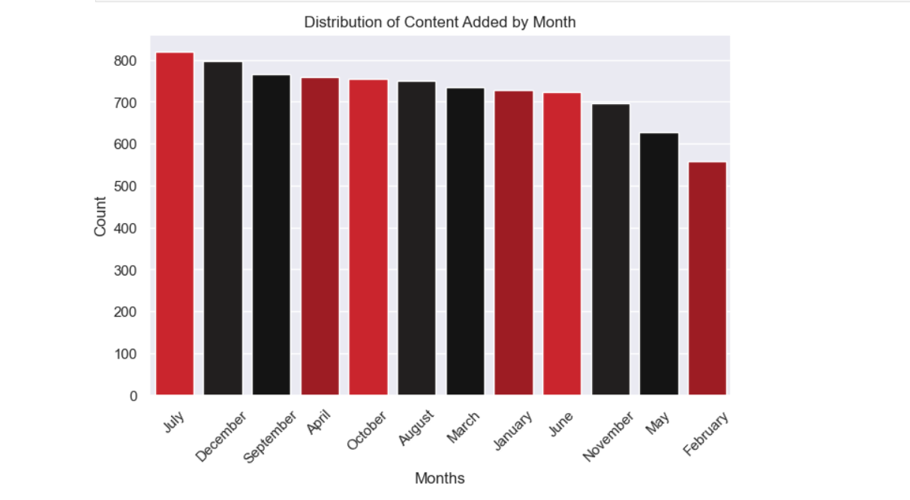

# 📊 Netflix Content Insights & Analysis

## 📘 Project Overview
Dive into the world of Netflix's vast content catalog with a thorough data analysis using Python, Pandas, Matplotlib, and Seaborn. This project aims to uncover hidden trends and patterns within Netflix’s movie and TV show offerings.

---

## 📂 Dataset Information
The dataset includes detailed attributes about Netflix content such as:
- Title, Show ID, Type (Movie/TV Show)
- Director, Cast, Country of Production
- Date Added, Release Year
- Rating, Duration, Categories (Genres)
- Description

---

## ❓ Key Analytical Questions

1. **Content Distribution**
   - How are movies and TV shows distributed across the platform?

2. **Popular Categories**
   - What genres are most commonly featured in Netflix’s top titles?

3. **Global Reach**
   - Which countries are leading in content contribution?

4. **Seasonal Patterns**
   - Are there ideal months for releasing content?

5. **Growth Over Time**
   - In which year was content production highest?

6. **Audience Ratings**
   - What are the most frequent content ratings across titles?

> 🧠 For detailed answers and visual breakdowns, check the notebook titled **Netflix Data Analysis**.

---

## 📈 Analytical Highlights

Here are some of the insights uncovered during the exploration:

### 🗓️ Best Months to Release Content

- July, December, and September are the top-performing months for content additions.

---

### 🌍 Leading Content Contributors

- The US, India, and the UK contribute the highest volume of content to Netflix.

---

## 🛠 Code Workflow

The project follows a structured flow:

- Importing and loading the dataset
- Cleaning and preprocessing the data
- Performing exploratory data analysis (EDA)
- Creating visual representations of key insights
- Summarizing findings and business recommendations

---

## 🔎 Key Takeaways

- **Content Split**: Netflix’s library is 69.6% movies and 30.4% shows.
- **Top Genres**: International TV Shows and Dramas are dominant.
- **Content Origin**: Most content originates from the US, India, and the UK.
- **Timing is Key**: July, December, and September are peak months for releasing new titles.
- **2018 Boom**: This year recorded the highest number of movie additions.
- **Viewer Preferences**: 'TV-MA' leads as the most common rating, with significant content in 'TV-14', 'TV-PG', and 'R'.

### 🎯 Recommendation

Focus on producing Drama films and International TV shows, release them around key months like July and December, and tailor content toward mature audiences to boost engagement.

---

**📢 Thank You for Exploring!**

Feel free to fork, star, or contribute to this project!

